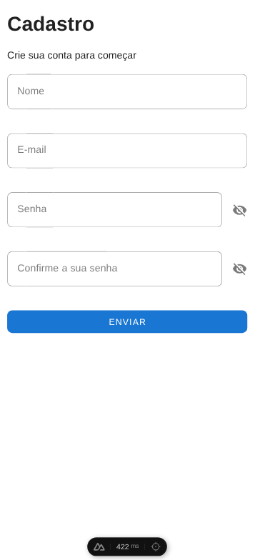
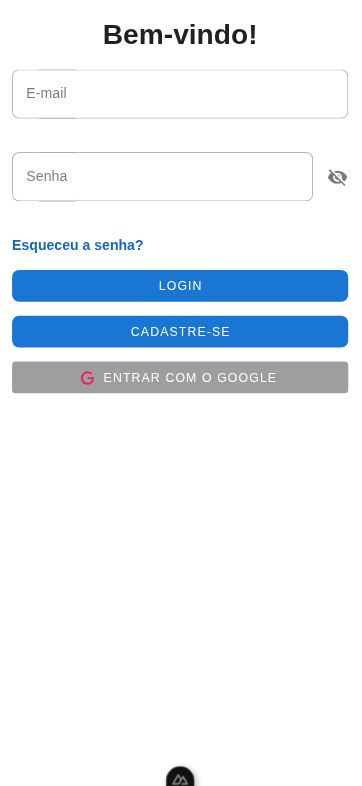
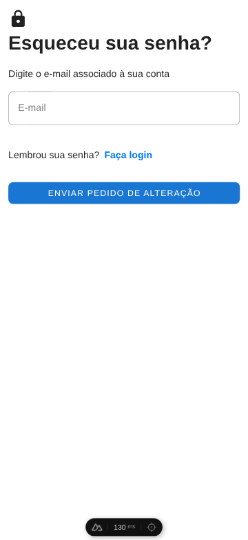
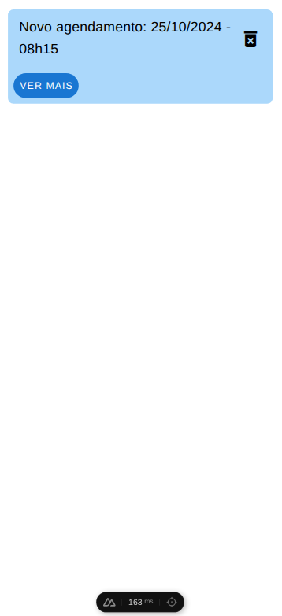
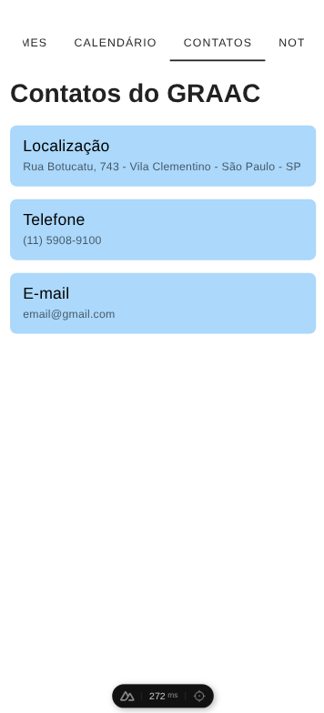
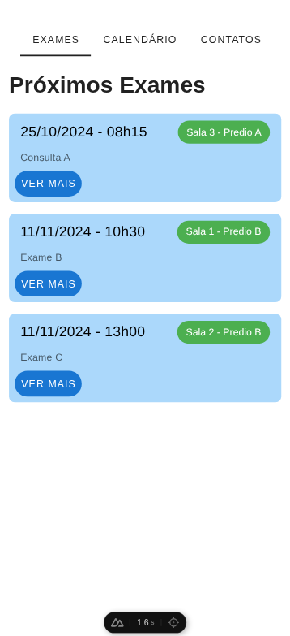
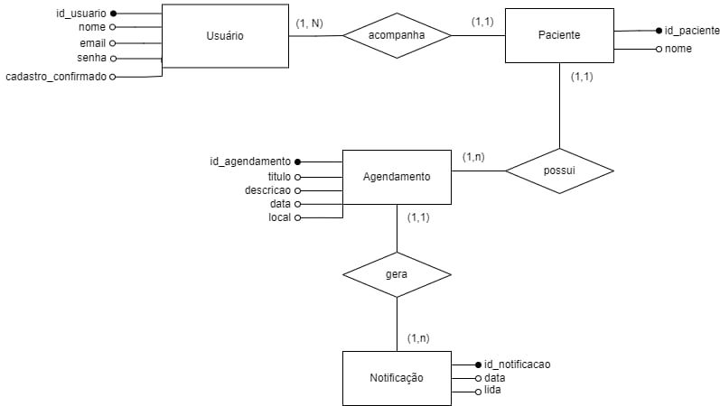

# **Agendinha do GRAAC**

## **Objetivo**

### *Gerais:*

- montar uma agenda em detalhes, a partir de um calendário;
- Exibir informações sobre contatos de médicos e funcionários;
- Marcar consultas e exames, tanto para pacientes quanto profissionais.

### *Específicos:*

- Transferir dados de uma agenda para o dispositivo móvel de forma local ou em nuvem (ex: Google Calendar).

## **Público Alvo**

Funcionários da instituição, médicos, enfermeiros e pais/responsáveis;

## **Onde o Projeto Será Utilizado**

A ideia é que seja utilizado no sistema principal do GRAAC (na forma de um aplicativo para dispositivos móveis), cuja integração será necessária realizar ao final do projeto.

## **Tecnologias Utilizadas**

- **Front-end**: Nuxt (Vue.js, Nitro, Vite);

- **Back-end**: Spring Boot (microsserviços).

## **Como Rodar o Projeto**
**1.** Instale Node.js e npm;

**2.** Clone o repositório e entre na pasta `graacc-web`;

**3.** Faça uma cópia de `.env.example` com o nome de `.env` e prepare as variáveis de ambiente;

**4.** Execute `npm install` ou `npm i`. Você também pode usar o Makefile com make (se fez dessa maneira, pode pular o passo 5);

**5.** Execute `npm run dev`;

**6.** *(Opcional)* Para executar a API mockada, clone e entre na pasta graacc-api-mock. Depois siga as instruções desse [Tutorial](*https://github.com/UnifespCodeLab/graacc-api-mock/blob/main/tutorial-wiremock.md*)

## **Protótipo**

[Link para o Figma](https://www.figma.com/destan/M4BjYcGLkDluFm9M8SKvh/GRAACmode-id=6-28p-f8t-x88a1Yj5G3XycbJ0-8)

## **Imagens do Protótipo**

### **Página de Cadastro**

### **Página de Login**

### **Página de 'Esqueceu a Senha'**

### **Página de Notificações**

### **Página de Contatos**

### **Página de Exames**

## **Diagrama Entidade-Relacionamento**

## **Status**

- [ ] Em ideação
- [x] Em desenvolvimento
- [ ] Testando com usuário
- [ ] Em uso
- [ ] Descontinuado
